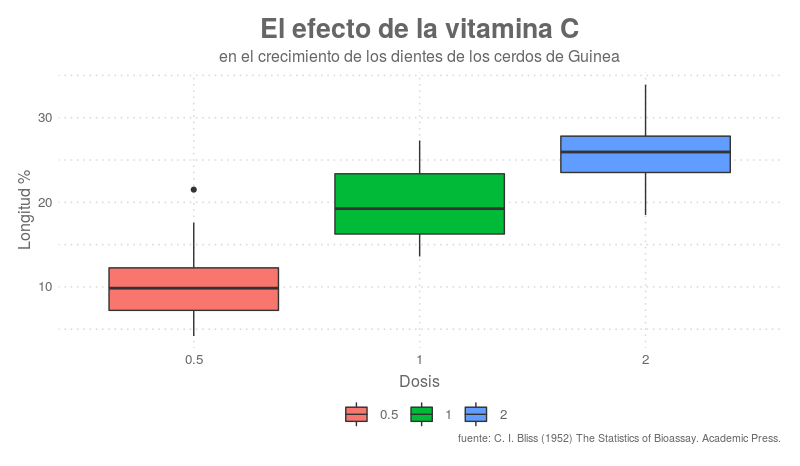

# ggelegant

`ggplot2` pero de "elegante sport"

   
  </img>
   

## Contenido

Esta paquete consta actualmente de una funcion: `theme_elegante_std()` que implementa un "customización" de los gráficos de `ggplot` que yo definiría como minimalista y elegante, obviamente es opinable, para ser más estrictos diría, que `theme_elegante_std()` es la configuración de `ggpolot` que a mí me gusta.

La idea a futuro, es ir incorporando, mejoras y herramientas que permitan mejorar la calidad visual de los gráficos de `ggplot2`.

**Nota**: `theme_elegante_std()` usa los fonts básicos de `ggplot2`, sin embargo recomiendo usar el tipo de letra  [Raleway](https://fonts.google.com/specimen/Raleway), verán los gráficos ganan basante en calidad. 

## Instalación

Como cualquier otro paquete mantenido en github.com, el proceso es relativamente sencillo. En primer lugar necesitaremos `devtools`:

    install.packages("devtools")

una vez instalada este paquete, simplemente podremos instalar `ggelegant` directamente desde el código fuente del repositorio:

    devtools::install_github("pmoracho/ggelegant")

## Requerimientos

Obviamente [ggplot2 ](https://ggplot2.tidyverse.org/)

## Actualizaciones

* 2019/00/01 - Commit inicial
